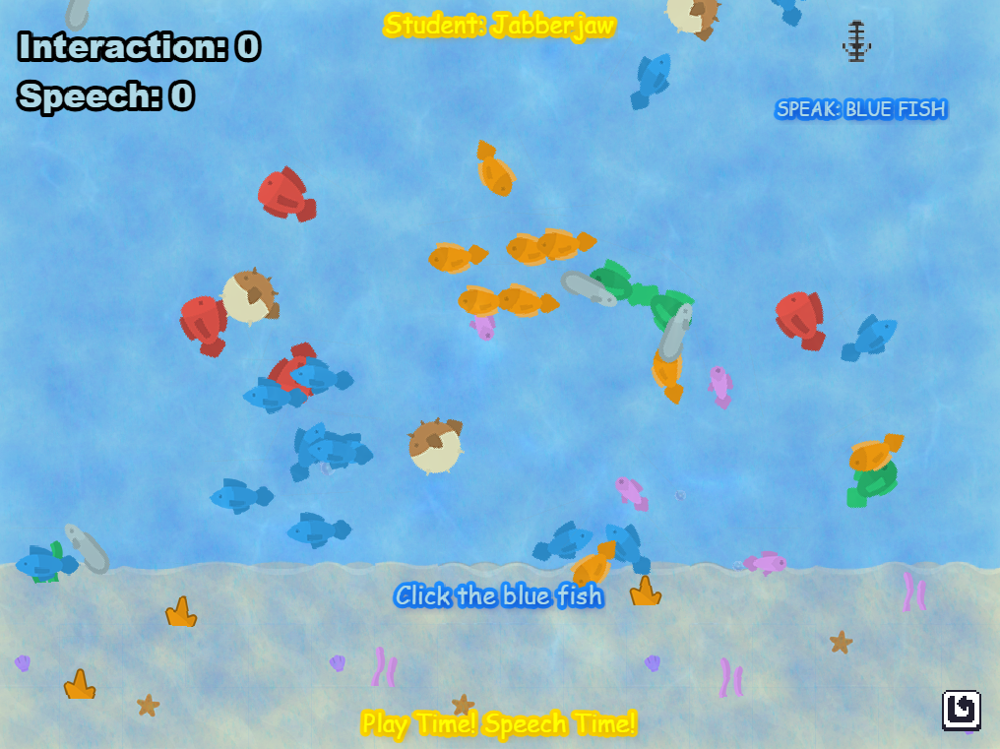

# Phaser 3 React TypeScript 

Ocean Speak is a Phaser 3 project Assessment

### Versions

This code has been updated for:

- [Phaser 3.87.0](https://github.com/phaserjs/phaser)
- [React 18.2.0](https://github.com/facebook/react)
- [Vite 5.3.1](https://github.com/vitejs/vite)
- [TypeScript 5.2.2](https://github.com/microsoft/TypeScript)

## Requirements

[Node.js](https://nodejs.org) is required to install dependencies and run scripts via `npm`.

## Available Commands

| Command | Description |
|---------|-------------|
| `npm install` | Install project dependencies |
| `npm run dev` | Launch a development web server |
| `npm run build` | Create a production build in the `dist` folder |
| `npm run dev-nolog` | Launch a development web server without sending anonymous data (see "About log.js" below) |
| `npm run build-nolog` | Create a production build in the `dist` folder without sending anonymous data (see "About log.js" below) |

## Writing Code

After cloning the repo, run `npm install` from your project directory. Then, you can start the local development server by running `npm run dev`.

The local development server runs on `http://localhost:8080` by default. Please see the Vite documentation if you wish to change this, or add SSL support.

Once the server is running you can edit any of the files in the `src` folder. Vite will automatically recompile your code and then reload the browser.

